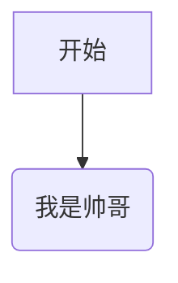

## 这是一个标题

### 这是第二个标题

## 粗体

**我是粗体**
__我也是粗体__

## 斜体

 *我是斜体*

 _我也是斜体_


 ## 没有空行

 我是第一行
 我是第二行

 ## 有空行

 我是第一行

 我是第二行

 ## 段内换行

 我是第一行，段内换行结尾插入两个空格  
 我是第二行
 [baidu](https://www.baidu.com)

 ## 列表
 1. 我有一个梦想
 2. 我有两个梦想
 3. 我有三个梦想

 # 无序列表

 ## 使用型号

 *  使用【星号】标示无序列表
 *  使用【星号】标示无序列表
 * 使用【星号】标示无序列表

 ## 使用加号
 + 使用【加号】标示无序列表
 + 使用【加号】标示无序列表

 ## 列表嵌套
 + 我是第一层列表
    + 我是第二层列表
        + 我是第三层列表
            + 我是第四层列表
            + 我还是第四层列表

## 有序列表和无序列表相互嵌套
1. 我是第一层列表
    + 我是第二次列表
        1. 我是第三层列表
        2. 我还是第三层列表

- 吃
- 喝
-  玩
-  乐

-   这个列表项  
    有换行

-  这个没有

1.  这个有序列表项  
    有换行

2.  这个没有

- 抽烟
- 喝酒
- 烫头

- 抽很多的  
  烟

- 喝酒

- 烫头

我的爱好：

- 抽烟

- 喝酒

- 烫头

跟于老师是一样的

1. 我是好人
2. 他是好人

a. 他是好人  
b. 我是好人

## 星号
***
* * *
***********

## 减号
---
- - -
-------

## 下划线

___
_ _ _
_______


## 图片

### 本地图片： 无图片替代文字


### 本地图片： 有图片替代文字


### 网络图片


## 文字链接

在日常生活中我们常用的网址有[百度](www.baidu.com).
[GitHub](https://github.com/)

## 引用链接
在日常生活中我们常用的网址有[百度]和[GitHub]

[百度]: (http://www.baidu.com)
[Github]: (https://github.com/)


### 超链接

<http://www.weibo.com/wirelessqa>

<wirelessqa@163.com>

## 代码块

### 行内代码
使用 `cd ..` 命令切换到上一级目录。  
使用 `mkdir 文件夹` 命令创建文件夹。

### 代码块
以Tab键开头：  

    def test_print():  
        pass

或者以4个空格开头：

    def test_print():  
        pass

围栏代码块支持语法高亮
```python
def print_name():
    print("Markdown")

```

```shell
$ echo "test"
test
```

## 引用

> 我是引用的巨资， 请在我的前边加上>(小于号)

正常的句子是这样的

## 多行引用

> 这是多行引用中的第一行，我的最后有两个空格  
这是多行引用的第二行

## 多行引用
> 这是引用的第一行

> 这是引用的第二行

## 引用中嵌套引用
> 引用中是可以嵌套引用的
>
>  > 我是引用中的引用

## 引用中使用其它Markdown标记

> 来点击我的[微博](http://www.baidu.com)
> 引用中**加粗**和*斜体*也是支持的

## 转义 

\\

\*

\`

\_

\{}

\[]


# GFW扩展语法

## 删除线

~~我是删除线~~

## 表情符号

:smile:

:laughing:

更多表情符号参考
<http://www.webpagefx.com/tools/emoji-cheat-sheet/。>

## 自动连接

www.baidu.com

<hwww.baidu.com>

http://baidu.com

<http://www.baidu.com>

不想使用自动连接
`www.baidu.com`

## 表格

- 基本表格

|序号 | 标题 | 网址 |
|-----|-----|------|
|01 | 百度 | http://www.baidu.com|
|02 | 谷歌 | http://www.google.com|


- 对齐格式

|左对齐 | 居中对齐 | 右对齐 |
|:---- | :------: | -----:|
|01 | 百度 | http://www.baidu.com |
|02 | 谷歌 | http://www.google.com |

## 表格内使用其它标记

|序号 | 标题 | 网址
|-----|-----|-----|
|*01* |[博客(http://www.baidu.com) | http://www.baidu.com]|
|**02** | [微博](http://www.google.com) | http://www.google.com/|


## 任务列表
今日工作

- [X] 吃
- [X] 喝
- [] 玩

明日计划：

- [ ] 吃
    - [x] 吃鱼
    - [ ] 吃瓜
- [x] 睡


## 围栏代码

~~~ python
def test_print():
    pass
~~~

## 锚点

目录

* [第01章](#第01章)
* [第02章](#第02章)

## 第01章
ba la ba la 

## 第02章
ba la ba la


## typora扩展语法

<u>下划线</u>

$ f(x,y) = \frac{x^2}{y^3} $


**## 任务列表**

今日工作

- [x]  吃

- [x]  喝

- [ ]  玩

- [x] 看电影


==高亮==

*普通*

**粗体**

==高亮==

**粗体**

*斜体*

echo

~~删除线~~


:smile:

```go
fmt.printf("test")
```

测试


<u>这段文字有下划线</u>


$ f(x,y) = \frac{x^2}{y^3} $


H~2~o

X^2^+y^2^


<!--我是注释-->[^参考]


$$
数学公式
$$


[TOC]

[^参考]:这段文字是对脚注的描述。


[^哈哈]: 这是一个脚注


## 图表

### 序列图


``` sequence
张三->李四: 李四，吃了吗？
Note right of 李四: 我显示在李四的右边
李四-->张三: 好久不见，三儿，我刚吃过！
```

### 流程图

```flow
st=>start:开始
op=>operation: 我是帅哥
cond=>condition: Yes or No?
e=>end: 结束


st->op->cond
cond(yes)->e
cond(no)->op
```


### marmaid图




测试一下打字机视图

测试一下

专注模式


